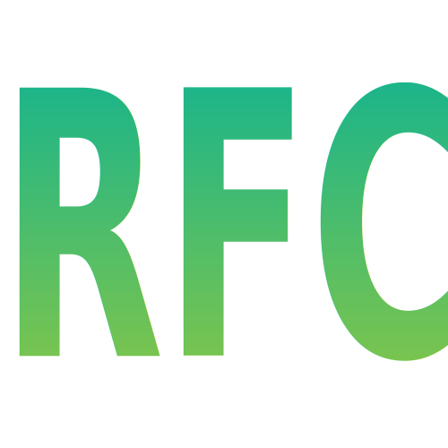

# RFC Finder

Introducing RFC Finder, a revolutionary Chrome browser extension designed to tackle the complex task of finding precise information within Internet standards. Computer networking researchers and developers often face the daunting challenge of sifting through the extensive collection of [IETF](https://en.wikipedia.org/wiki/Internet_Engineering_Task_Force) [Request for Comments (RFC)](https://en.wikipedia.org/wiki/Request_for_Comments) to locate the specific data they need.

RFC Finder is the solution to this problem, streamlining the research process thanks to its advanced search capabilities. What sets RFC Finder apart is its use of the [Okapi BM25](https://en.wikipedia.org/wiki/Okapi_BM25) retrieval function working on top of an inverted index that encompasses over 10,000 Internet standards. This goes beyond traditional search capabilities, which rely solely on exact keyword matches.

Get started with RFC Finder today! Please share your feedback and let us know what new features you want to see next.

## Getting Started

1. The RFC Finder uses a [Python](https://www.python.org/) based backend. Since the backend needs [`metapy`](https://github.com/meta-toolkit/metapy), Python bindings for the [MeTA toolkit](https://meta-toolkit.org/), and `metapy` does not work well in Python 3.5+ across all environments, the procedure shown below recommends the creation of a separate [conda](https://conda.io/) virtual environment.

```bash
# make sure you install `conda` first before proceeding further

# create and activate your `conda` virtual environment
conda create -n rfc_finder
conda activate rfc_finder

# only run this if you are using a Mac with Apple silicon
conda config --env --set subdir osx-64

# install Python 3.5.x
# (`metapy` rankers do not work in macOS if Python version 3.5+)
conda install python=3.5

# time to upgrade and install rest of Python packages needed
pip install --upgrade pip
pip install metapy pytoml notebook bottle xmltodict
```

2. Now you have your Python environment ready, go to a folder of your choice and clone this repo. Since you will need to download the entire RFC corpus, you should plan to have no less than 800 MB of storage available to run RFC Finder.

```bash
git clone https://github.com/ger6-illini/rfc_finder.git
```

3. Go inside the folder where you cloned the repo, e.g., `rfc-finder/`, make sure you are inside the conda virtual environment `rfc_finder`, and run the `get_rfcs.py` program. `get_rfcs.py` downloads the entire RFC corpus using the [RFC Editor](https://www.rfc-editor.org/) `rsync` server, so before running it make sure you are connected to the Internet and you are not sitting behind any firewalls that can block the `rsync` service. This step might take time but it should be over in less than five minutes if you are using a decent Internet connection. Once all the files are downloaded, `get_rfcs.py` will create an inverted index which might take a minute or so. This index will be stored in a folder called `idx/`. It is recommended you run `get_rfcs.py` on a regular basis maybe daily, weekly, biweekly or monthly, depending on how often you want to keep your index updated. To do that make use of your favorite scheduler. Some scheduler examples are `crond` in Linux (a good tutorial [here](https://ostechnix.com/a-beginners-guide-to-cron-jobs/)) or `launchd` in Mac OS.

```bash
# make sure you are in the `conda` virtual environment you created before
# if you are not, or you are not sure run...
conda activate rfc_finder

# run this from the project folder (the one cloned using `git clone`)
python get_rfcs.py
```

4. Install the Chrome extension as indicated in [this link](https://developer.chrome.com/docs/extensions/mv3/getstarted/development-basics/#load-unpacked). The extension directory is same as the project folder where you cloned the repo, e.g., `rfc-finder/`. If you face an issue where Chrome cannot upload the extension folder because there is a subfolder with a name starting with `__`, please go and delete the subfolder called `__pycache__`, and try again. This folder contains bytecode-compiled versions of the Python RFC Finder programs created by the Python interpreter and will be regenerated next time the programs need to run.

## How to Use

To start RFC Finder, you will always need to start the backend first. Please go to the project folder where you cloned the repo, e.g., `rfc-finder/`, make sure you are inside the conda virtual environment `rfc_finder`, and run the `rfc_finder.py` program. `rfc_finder.py` runs on TCP port 5000 so make sure no other service is making use of it.

```bash
# make sure you are in the `conda` virtual environment you created before
# if you are not, or you are not sure run...
conda activate rfc_finder

# run this from the project folder (the one cloned using `git clone`)
python rfc_finder.py
```

