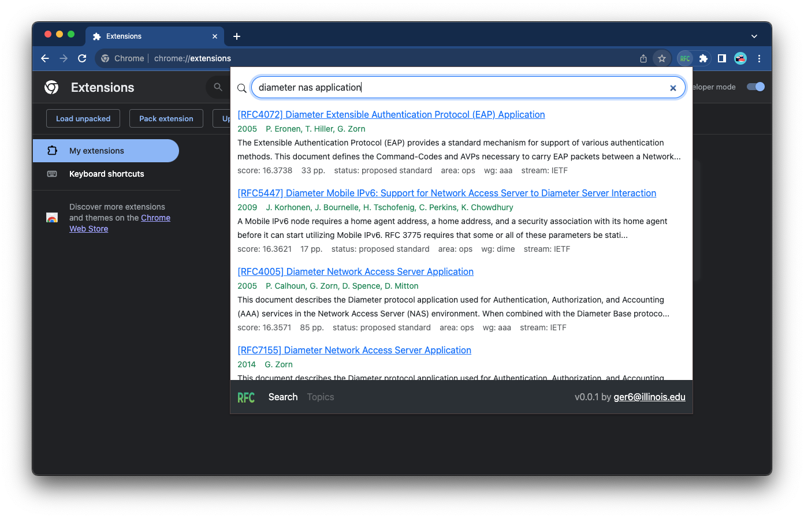
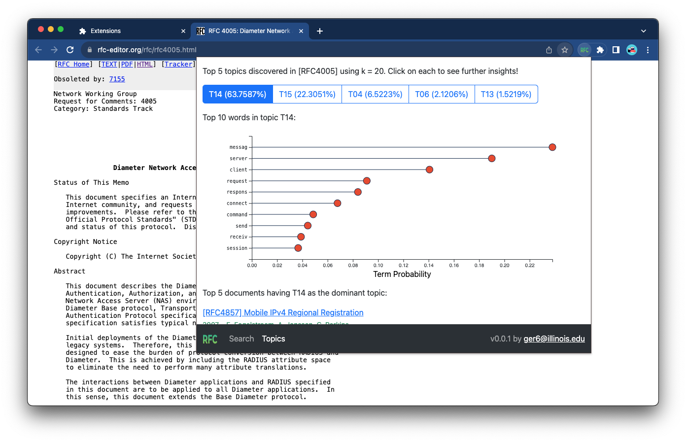
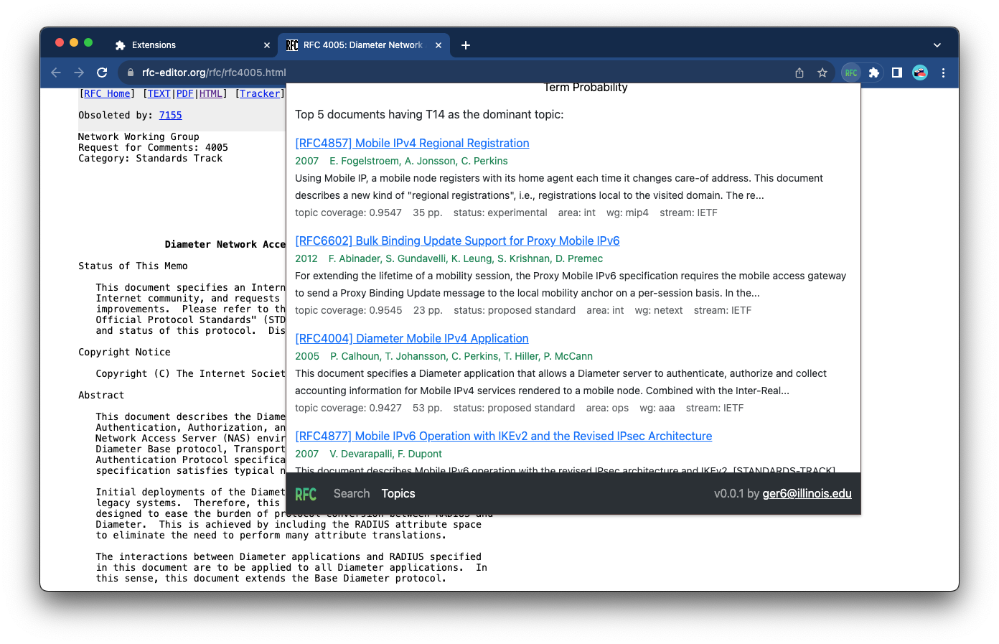
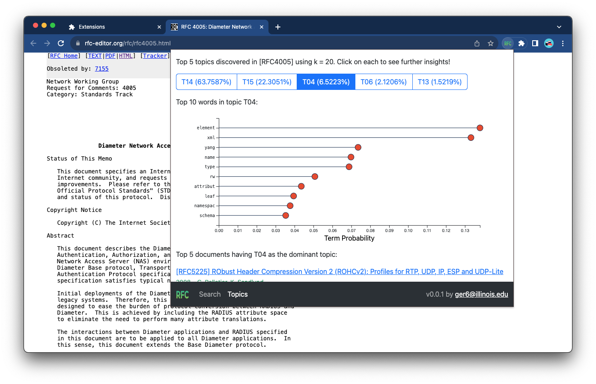

# RFC Finder

Introducing RFC Finder, a revolutionary Chrome browser extension designed to tackle the complex task of finding precise information within Internet standards. Computer networking researchers and developers often face the daunting challenge of sifting through the extensive collection of [IETF](https://en.wikipedia.org/wiki/Internet_Engineering_Task_Force) [Request for Comments (RFC)](https://en.wikipedia.org/wiki/Request_for_Comments) to locate the specific data they need.

RFC Finder is the solution to this problem, streamlining the research process thanks to its advanced search capabilities. What sets RFC Finder apart is its use of the [Okapi BM25](https://en.wikipedia.org/wiki/Okapi_BM25) retrieval function working on top of an inverted index that encompasses over 10,000 Internet standards. This goes beyond traditional search capabilities, which rely solely on exact keyword matches.

Get started with RFC Finder today! Please share your feedback and let me know what new features you would like to see next.

## Table of Contents

- [Author](#author) 
- [Getting Started](#getting-started)
- [How to Use](#how-to-use)
  - [Starting the Backend](#starting-the-backend)
  - [Searching Terms](#searching-terms)
  - [Exploring Topics](#exploring-topics)
- [License](#license)

## Author

Gilberto Ramirez [<ger6@illinois.edu>](mailto:ger6@illinois.edu) completed this as the final project for the CS410 Text Information Systems course at [UIUC](https://illinois.edu/) in Fall 2023.

## Tutorial Video

For a short video tutorial on how to install and use RFC Finder please go to [this link](https://youtu.be/mRecVEjrpXs).

## Getting Started

1. The RFC Finder uses a [Python](https://www.python.org/) based backend. Since the backend needs [`metapy`](https://github.com/meta-toolkit/metapy), Python bindings for the [MeTA toolkit](https://meta-toolkit.org/), and `metapy` may encounter compatibility issues in Python releases newer than 3.5 across various environments, I recommend the procedure outlined below, which involves creating a dedicated [`conda`](https://conda.io/) virtual environment.

```bash
# make sure you install `conda` first before proceeding further

# create and activate your `conda` virtual environment
conda create -n rfc_finder
conda activate rfc_finder

# only run this if you are using a Mac with Apple silicon
conda config --env --set subdir osx-64

# install Python 3.5.x
# (`metapy` rankers do not work in macOS if Python versions newer than 3.5)
conda install python=3.5

# time to upgrade and install rest of Python packages needed
pip install --upgrade pip
pip install metapy pytoml bottle xmltodict pandas
```

2. Now you have your Python environment ready, go to a folder of your choice and clone this repo. Since you will need to download the entire RFC corpus, you should plan to have no less than 800 MB of storage available to run RFC Finder.

```bash
git clone https://github.com/ger6-illini/rfc_finder.git
```

3. Upon cloning the repository, you will find the following files inside the `rfc_finder/` folder. Each file is accompanied by a brief description to help you understand its purpose:

```bash
.
├── LICENSE                                # (MIT) license file
├── README.md                              # this file!
├── config.toml                            # master MeTA config
├── corpus                                 # will store RFCs corpus
│   └── file.toml                          # MeTA config for RFCs file corpus
├── css
│   └── bootstrap.min.css                  # Bootstrap minified CSS
├── discover_topics.py                     # Python program to discover latent topics
├── docs
│   ├── project-final-report_ger6.pdf      # Project final report
│   ├── project-progress-report_ger6.pdf   # Project progress report
│   └── project-proposal_ger6.pdf          # Project proposal report
├── get_rfcs.py                            # Python program to download RFCs corpus
├── images
│   ├── howtouse-searching-1.png           # for use in README.md
│   ├── howtouse-topics-1.png              # for use in README.md
│   ├── howtouse-topics-2.png              # for use in README.md
│   ├── howtouse-topics-3.png              # for use in README.md
│   ├── icon-128.png                       # Chrome extension icon for installation and Chrome Web Store
│   ├── icon-16.png                        # Chrome extension icon for favicon
│   ├── icon-32.png                        # Chrome extension icon for favicon (will try this first)
│   ├── icon-48.png                        # Chrome extension icon for chrome://extensions
│   └── icon.svg                           # Chrome extension icon the mother of all icons
├── js
│   ├── bootstrap.bundle.min.js            # Bootstrap minified JavaScript library
│   ├── d3.v7.min.js                       # D3 JavaScript library
│   ├── jquery-3.7.1.min.js                # jQuery JavaScript Library
│   └── popup.js                           # Chrome extension master JavaScript file
├── lemur-stopwords.txt                    # stop words to be used by MeTA
├── manifest.json                          # Chrome extension manifest for RFC Finder 
├── popup.html                             # Chrome extension master HTML file
├── rfc_finder.py                          # Python backend program for RFC Finder (web app)
└── rfcs.py                                # Python backend program for RFC Finder (class file)
```

4. Go inside the folder where you cloned the repo, e.g., `rfc-finder/`, make sure you are inside the conda virtual environment `rfc_finder` you created in step 2, and run the `get_rfcs.py` program. `get_rfcs.py` downloads the entire RFC corpus using the [RFC Editor](https://www.rfc-editor.org/) `rsync` server, so before running it make sure you are connected to the Internet and you are not sitting behind any firewalls that can block the `rsync` service. This step might take time but it should be over in less than five minutes if you are using a decent Internet connection. Once all the files are downloaded, `get_rfcs.py` will create both an inverted index and a forward index which might take a minute or so. This index will be stored in a folder called `idx/`. It is recommended you run `get_rfcs.py` on a regular basis maybe daily, weekly, biweekly or monthly, depending on how often you want to keep your index updated. To do that make use of your favorite scheduler. Some scheduler examples are `crond` in Linux (a good tutorial [here](https://ostechnix.com/a-beginners-guide-to-cron-jobs/)) or `launchd` in Mac OS. For reference, see below the commands and an example of how your terminal might look like after completing the process.

```bash
# go inside the repo folder (created with `git clone`)
# (if you are not there yet)
cd rfc_finder/

# make sure you activated the `conda` virtual environment you created in step 2!
# if you are not, or you are not sure run...
conda activate rfc_finder

python get_rfcs.py
```

```
(rfc_finder) project/rfc_finder [main] » python get_rfcs.py 

               _              
  ____ _____ _| |_            
 / _  | ___ (_   _)           
( (_| | ____| | |_            
 \___ |_____)  \__)           
(_____|                       
 ______  _______ _______      
(_____ \(_______|_______)     
 _____) )_____   _        ___ 
|  __  /|  ___) | |      /___)
| |  \ \| |     | |_____|___ |
|_|   |_|_|      \______|___/ 

v 0.0.1 | MIT License | 2023 | by Gilberto Ramirez <ger6@illinois.edu>
  
[2023-11-10 14:51:58.072127] `corpus/` folder exists... good!
[2023-11-10 14:51:58.072156] `corpus/file.toml` file exists... good!
[2023-11-10 14:51:58.072169] `rsync` will run for the first time. Please be patient...
[2023-11-10 14:52:48.107567] `rsync` completed... 11515 files added/modified/deleted
[2023-11-10 14:52:48.139515] file `corpus/rfcs-full-corpus.txt` created!
[2023-11-10 14:52:48.139552] Recreating indices. Please be patient...
[2023-11-10 14:53:03.085203] Inverse index done! 9292 docs, 252848 unique terms, avg doc length 3742 chars
[2023-11-10 14:53:17.875410] Forward index done! 9292 docs, 252848 unique terms
[2023-11-10 14:53:17.875487] Corpus update done! It took me 80 seconds. Am I amazing or what?
[2023-11-10 14:53:17.875499] Bye!
(rfc_finder) project/rfc_finder [main] » 
```

5. Run the `discover_topics.py` program which will discover in an unsupervised way latent topics in the RFCs corpus using LDA with Gibbs sampling. This step will take several minutes, so please be patient. By default, this program will discover 20 topics and that might take close to 30 minutes in a 2021 MacBook Pro. You might want to run this program after updating the corpus on a regular basis as suggested in the previous step. For reference, see below the commands and an example of how your terminal might look like after completing the process.

```bash
# make sure you are inside the project folder, and in the right `conda` environment
python discover_topics.py
```

```
(rfc_finder) project/rfc_finder [main] » python discover_topics.py

     _ _                                  
    | (_)                                 
  __| |_  ___  ____ ___ _   _ _____  ____ 
 / _  | |/___)/ ___) _ \ | | | ___ |/ ___)
( (_| | |___ ( (__| |_| \ V /| ____| |    
 \____|_(___/ \____)___/ \_/ |_____)_|    
                                          
                  _                       
   _             (_)                      
 _| |_ ___  ____  _  ____  ___            
(_   _) _ \|  _ \| |/ ___)/___)           
  | || |_| | |_| | ( (___|___ |           
   \__)___/|  __/|_|\____|___/            
           |_|                            

v 0.0.1 | MIT License | 2023 | by Gilberto Ramirez <ger6@illinois.edu>
  
[2023-11-10 15:02:09.363029] Running discovery of 20 topics using LDA Gibbs sampling with alpha = 0.1, beta = 0.1, iters = 1000
[2023-11-10 15:02:09.363097] Please be patient. As an example, discovering 20 topics might take 20 to 30 minutes in a 2021 MacBook Pro...
[2023-11-10 15:51:02.655740] All done! Results were written to 'models/lda-pgibbs-20'. Now you are ready to explore topics in RFC Finder!
[2023-11-10 15:51:02.655801] It took me 48 minutes to discover 20 topics
[2023-11-10 15:51:02.655812] Bye!
(rfc_finder) project/rfc_finder [main] » 
```

6. Install the Chrome extension as indicated in [this link](https://developer.chrome.com/docs/extensions/mv3/getstarted/development-basics/#load-unpacked). The extension directory is same as the project folder where you cloned the repo, e.g., `rfc-finder/`. If you face an issue where Chrome cannot upload the extension folder because there is a subfolder with a name starting with `__`, please go inside `rfc_finder/`, delete the folder `__pycache__/`, and try installing the extension again. This folder contains bytecode-compiled versions of the Python RFC Finder programs created by the Python interpreter and will be regenerated next time the programs need to run.

## How to Use

### Starting the Backend

To use RFC Finder, you will always need to start its backend first. Please go to the project folder where you cloned the repo, e.g., `rfc-finder/`, make sure you are inside the `conda` virtual environment `rfc_finder`, and run the `rfc_finder.py` program. `rfc_finder.py` runs on TCP port 5000 so make sure no other service is making use of it. Below the commands needed to start the backend:

```bash
# go inside the project folder (the one cloned using `git clone`)
# (if you are not there yet)
cd rfc_finder/

# make sure you are in the `conda` virtual environment you created before
# if you are not, or you are not sure run...
conda activate rfc_finder

# run this once inside the project folder (the one cloned using `git clone`)
python rfc_finder.py
```

After starting the backend you should see something like this in your terminal window:

```
(rfc_finder) project/rfc_finder [main] » conda activate rfc_finder
(rfc_finder) project/rfc_finder [main] » rfc_finder python rfc_finder.py

 ______  _______ _______    _______ _           _             
(_____ \(_______|_______)  (_______|_)         | |            
 _____) )_____   _          _____   _ ____   __| |_____  ____ 
|  __  /|  ___) | |        |  ___) | |  _ \ / _  | ___ |/ ___)
| |  \ \| |     | |_____   | |     | | | | ( (_| | ____| |    
|_|   |_|_|      \______)  |_|     |_|_| |_|\____|_____)_|    

v 0.0.1 | MIT License | 2023 | by Gilberto Ramirez <ger6@illinois.edu>

Bottle v0.12.25 server starting up (using WSGIRefServer())...
Listening on http://localhost:5000/
Hit Ctrl-C to quit.

```

Leave this terminal window open. It will show the HTTP requests/responses managed by the RFC Finder web service. Whenever you finish working with RFC Finder, you can stop the backend using <kbd>⌃ Control</kbd> + <kbd>C</kbd>.

### Searching Terms

To search for terms in the RFCs corpus, open your Chrome browser and activate the profile where you installed the RFC Finder extension. Click the RFC Finder icon (if pinned) or access it from the extensions menu. The RFC Finder popup window will appear, allowing you to enter your query terms in the search box. Press <kbd>⏎ Enter</kbd> when done to retrieve the results.

RFC Finder is configured to display the top 10 most relevant results for the given query. The results are sorted by score, with the most relevant result in the first position.



You can click any of the listed links, and RFC Finder will open a new tab with the content of the link. All links are from the [RFC Editor](https://www.rfc-editor.org/) site, the authoritative source for all Internet standards.

Each result includes the following metadata:

- **RFC Identifier ([RFC####]):** The four-digit RFC number followed by the title of the RFC.
- **Year of Publication.**
- **Authors, including the editor.**
- **Abstract (if available).**
- **BM25 Okapi Ranker Score:** Indicates relevance against input query.
- **Number of Pages.**
- **RFC Status:** Internet standard, proposed standard, best current practice, or informational. [More details](https://en.wikipedia.org/wiki/Request_for_Comments).
- **IETF Area Acronym:** Such as RAI (Real-Time Applications and Infrastructure Area). A tooltip provides the expanded form of the acronym.
- **IETF Working Group:** The group that worked on the RFC.
- **IETF Stream:** e.g., IETF or [IAB](https://www.ietf.org/about/groups/iab/), to which the RFC belongs.

### Exploring Topics

RFC Finder includes a feature that provides a list of topics covered in a specific RFC along with their percentage of coverage. This feature is particularly useful for researchers who want to quickly assess whether an RFC addresses topics of interest before delving into the entire specification.

To use the *Topics* feature, follow these steps:

1. Open the RFC you are interested in on the [RFC Editor](https://www.rfc-editor.org/) website, such as [RFC6733: Diameter Base Protocol](https://www.rfc-editor.org/rfc/rfc6733.html).

2. Open the RFC Finder extension and click on the *Topics* link in the navigation bar at the bottom. Please note that this feature is only available when browsing an RFC from the RFC Editor website. If the browser tab does not have an RFC loaded, the *Topics* feature will be disabled.

3. The *Topics* feature provides three sections for the selected RFC:

   - The top section lists the top 5 topics covered in the document, identified by labels like `T##` (## is a number from 1 to 20). It includes the percentage of coverage for each topic.
   
   - The middle section displays a lollipop chart of the top ten words for the topic versus their probability. This chart helps visualize the importance of words in the selected topic.
   
   - A list of the top 5 documents related to the selected topic based on coverage. These documents can offer insights into the topic's relevance.



4. Scroll down to view additional results for the selected topic, as shown in the example below:



5. You can select another topic using the radio buttons for further exploration. The data loading is nearly instantaneous, as it was uploaded to the DOM when the *Topics* link was clicked.



## License

RFC Finder is [MIT](./LICENSE) licensed.

